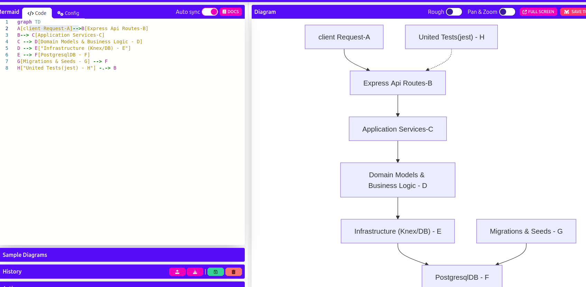
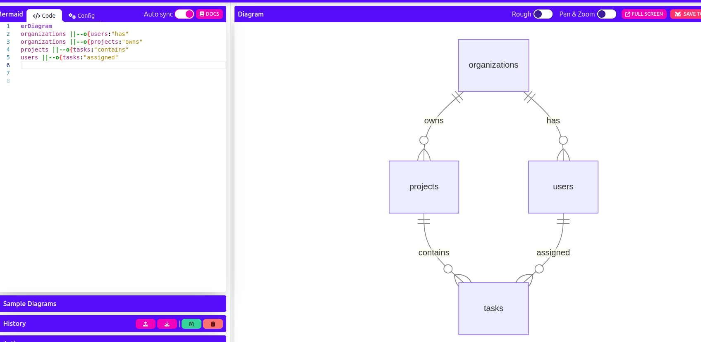
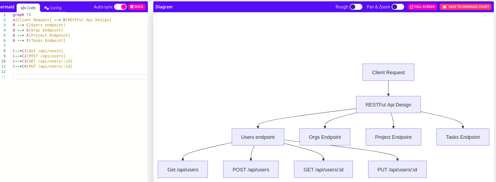

# To do app - backend created by Rasmus

This project was designed using Domain-Driven Design principles

This is the backend for a group todo application

## Archtecture

- **Domain**: Contains core business logic for Users, Organizations, Project, Tasks
- **Application**: Implements services that orchestrate use cases
- **Infrastructure**: Database connection using Knex
- **API**: Express routes for RESTFul endpoints.


## Getting Started

1. Install dependencies:
```bash
npm install

```
2. Run test
```bash
npm run test
```

3. Archtectures




